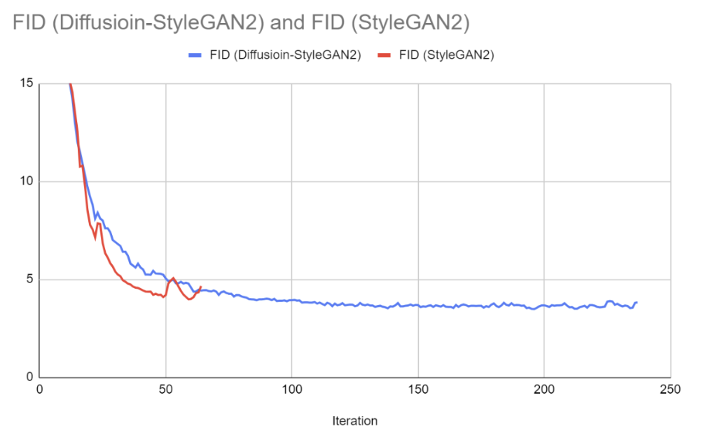
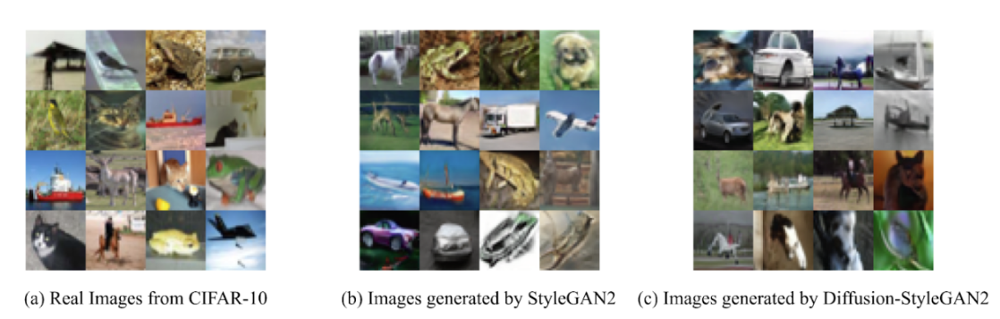
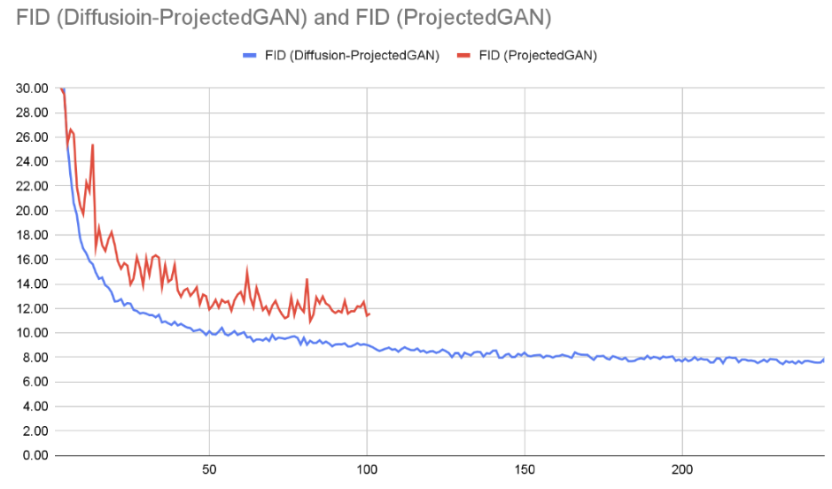
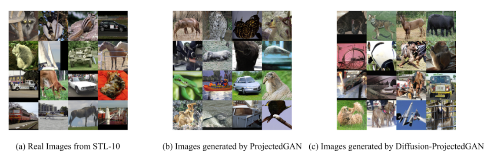
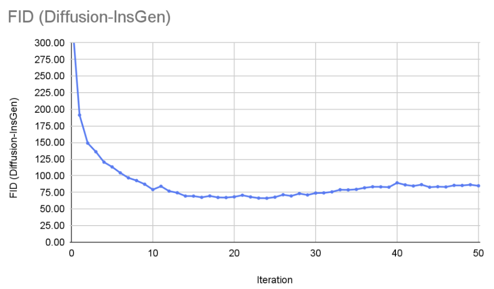
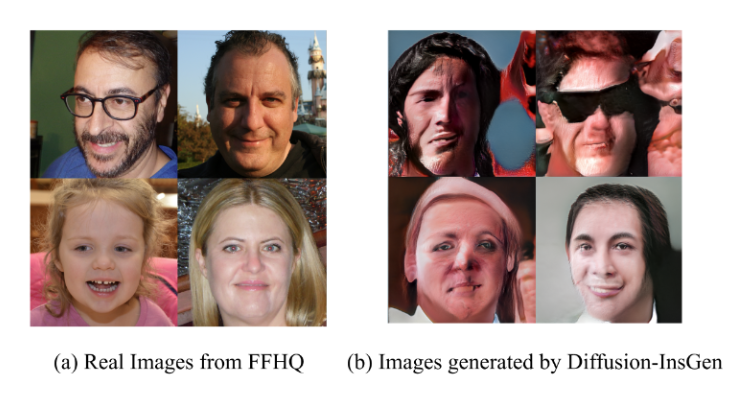
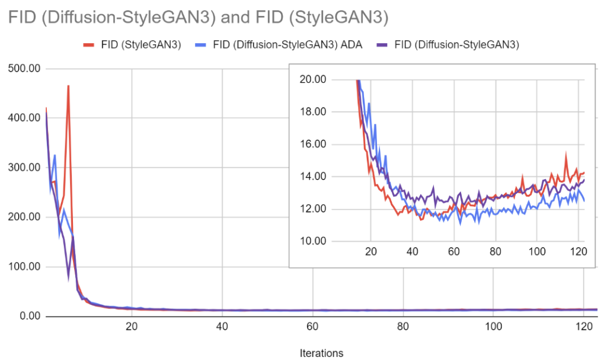
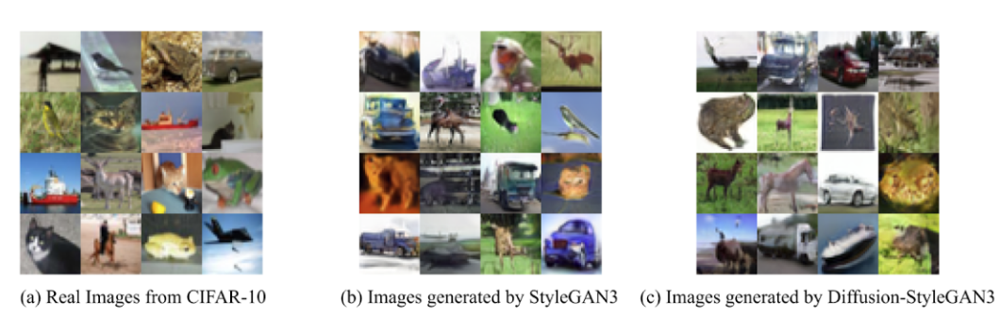

# Reproducing and Verifying Diffusion-GAN: Enhancing GAN Training with Multi-step Diffusion Process

***2023 Fall 11785 Final Project***

***Team Member***:
|  Name         | Andrew ID |
| :------------ | :-------- |
| Yihui Song    | yihuison  |
| Jianxuan Tan  | jianxuat  |
| Jiangqi Zhu   | jiangqiz  |

---

### Abstraction

Both Generative Adversarial Networks (GANs) and diffusion models are challenged by the generative learning trilemma: high quality samples, fast sampling, and mode coverage/ diversity. Besides, the stability of GANs is recognized as a main problem. ***This project aims to reproduce a conference paper, [Diffusion-GAN: Training GANs with Diffusion (ICLR 2023)](https://arxiv.org/pdf/2206.02262.pdf)***. In this project, the authors proposed to address these problems by training GANs with a multi-step diffusion process. The project retrained the authors’ models as well as baseline models, compared the training results with the paper, and extended the method to a new Diffusion-GAN model to further validate the authors’ findings.


### Codebase Introduction

This code repository contains 7 folders, each folder contains a GAN model that can be run independently. Here is the list of the GAN model in this repository:

- Diffusion InsGen
- Diffusion Projected-GAN
- Diffusion StyleGAN2
- Diffusion StyleGAN3
- Projected GAN
- StyleGAN2
- StyleGAN3

The reason why the above models were selected is because StyleGAN2, InsGen, Projected are used to conduct experiments in the paper [Diffusion-GAN: Training GANs with Diffusion (ICLR 2023)](https://arxiv.org/pdf/2206.02262.pdf). 

At the same time, because the paper claims that diffusion noise is universal, we chose StyleGAN3 as an extended experiment. By comparing its training performance before and after adding diffusion noise, we can judge whether diffusion noise is effective for most GAN models.

### Project Contribution

- Reproduce experiments about Diffusion-InsGen, Diffusion-StyleGAN2, and Diffusion-ProjectedGAN conducted in the paper [Diffusion-GAN: Training GANs with Diffusion (ICLR 2023)](https://arxiv.org/pdf/2206.02262.pdf)
- Conduct baseline experiments on StyleGAN2, ProjectedGAN, and StyleGAN3.
- Add diffusion noise to StyleGAN3 model.


### Train Our Diffusion-GAN

We show the training commands that we used below. In most cases, the training commands are similar.

For Diffusion-StyleGAN2
```sh
python ./diffusion-stylegan2/train.py --outdir=training-runs \
--data="cifar-10.zip" --gpus=1 --cfg cifar --kimg 50000 --aug no \
--target 0.6 --noise_sd 0.05 --ts_dist priority
```

For Diffusion-InsGen
```sh
python ./diffusion-insgen/train.py --outdir=training-runs --data="ffhq.zip" \
--gpus=4 --batch 64 \
--batch-gpu=16 --cfg stylegan2 --ts_dist uniform --kimg 50000 --target 0.6 --noise_sd 0.5
```

For Diffusion-ProjectedGAN
```sh
pip install timm==0.5.4

python diffusion-projected-gan/train.py --outdir=training-runs --data="~/stl10.zip" --gpus=1 --batch 64 \
--batch-gpu=16 --cfg fastgan --kimg 50000 --target 0.45 --noise_sd 0.5
```


For Diffusion-StyleGAN3
```sh
cd diffusion-stylegan3/

python train.py \
--outdir training-runs \
--data /mnt/f/working/python/11785_Final_Project/stylegan2/cifar-10.zip \
--gpus 1 \
--cfg stylegan3-t \
--batch 32 \
--gamma 8.2 \
--mirror 1 \
--aug ada \
--target 0.6 \
--noise_sd 0.05 \
--ts_dist priority
```

### Result

Here is a summary table of the training results represented in FID of different models.

| Category | Model Name               | Dataset  | FID in Paper | Our FID Results (Iteration # with the best FID / Total iterations) |
|----------|:--------------------------|:----------|:--------------|:---------------------------------------------------------------|
| (a)      | StyleGAN2                | CIFAR-10 | 8.32         | 3.98 *(Iteration No.59 of 64)*                                  |
|          | Diffusion StyleGAN2      | CIFAR-10 | 3.19         | 3.48 *(Iteration No.196 of 237)*                                |
| (b)      | ProjectedGAN             | STL-10   | 7.76         | 10.96 *(Iteration No.232 of 246)*                           |
|          | Diffusion ProjectedGAN   | STL-10   | 6.91         | 7.45 *(Iteration No.232 of 246)*                                |
| (c)      | InsGen                   | FFHQ (500) | 54.762    | N/A                                                         |
|          | Diffusion InsGen         | FFHQ (500) | 50.39      | 66.256 *(Iteration No.24 of 28)*                               |
| (d)      | StyleGAN3 + ADA          | CIFAR-10 | N/A          | 11.34 *(Iteration No.44 of 123)*                                |
|          | Diffusion StyleGAN3 + ADA| CIFAR-10 | N/A          | 12.18 *(Iteration No.74 of 123)*                                |
|          | Diffusion StyleGAN3      | CIFAR-10 | N/A          | 11.15 *(Iteration No. 63 of 96)*                                |

#### StyleGAN2



#### ProjectedGAN



#### InsGen
It is very difficult to train Diffusion-InsGen running on FFHQ (500) due to the high-resolution of the training set. We observed a stable training progression during the training of Diffusion-InsGen and achieved the lowest FID value of 66.256 among 28 interactions. Meanwhile, although we ran the code of InsGen successfully, the training results started to seem abnormal from the very beginning (FID: 2.42E+82, 1.46E+80, 1.06E+74, 3.53E+72 from iteration 0 to 3. We did not continue the training as such large FIDs were unlikely to converge within a reasonable number of steps. Training InsGen model required a much larger data set (FFHQ 500) and consumed a great amount of resources. Considering the time and resource limits, we were unable to find the root cause and retrain this model to get a reliable result.




#### StyleGAN3




---
### Useful Resource

Project Video: [11-785 Deep Learning Final Project: Reproducing and Verifying Diffusion-GAN](https://www.youtube.com/watch?v=lj9nIg5ENpw)